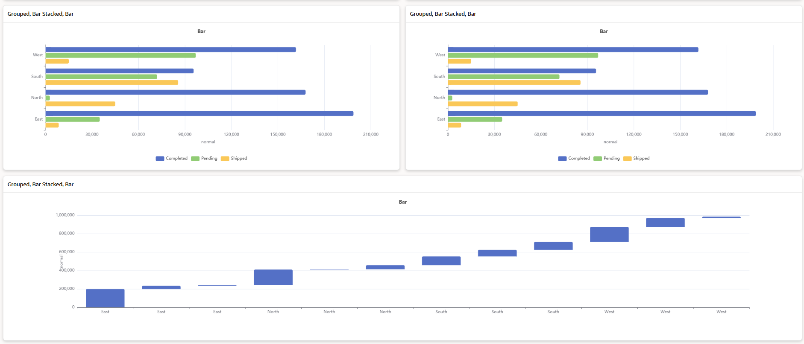
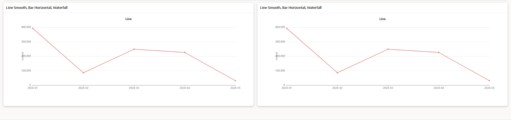
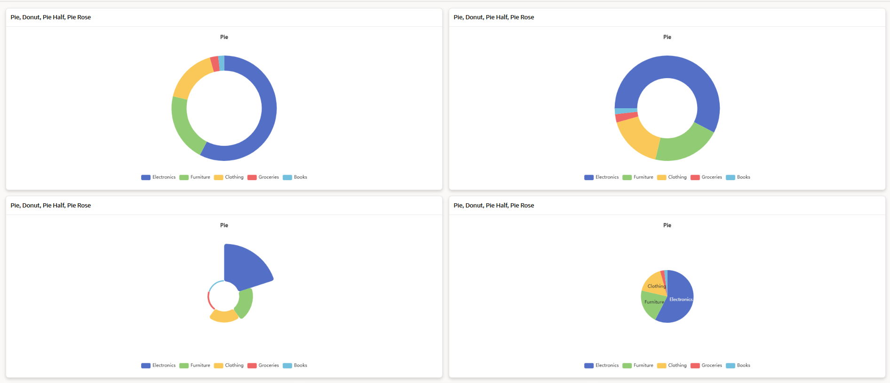

# Apache ECharts Region Plugin for Oracle APEX

This plugin integrates **Apache ECharts** with **Oracle APEX** as a reusable Region Plugin to build modern interactive charts.

Apache ECharts is a powerful open-source charting library that allows developers to create highly customizable and interactive data visualizations directly inside Oracle APEX applications.

---

## Features

- Apache ECharts integration  
- Interactive charts  
- JSON configuration support  
- Works with Oracle APEX 19.2+  
- Lightweight implementation  
- Easy integration with APEX regions  

---

## Installation

1. Import the plugin file into your APEX workspace

`region_type_plugin_com_thapliyalravi_echarts_region.sql`

2. Import the demo application

`echarts_demo_app.sql`

3. Create a region in Oracle APEX and select:

`Apache ECharts Region Plugin`

---

## Screenshots

### Bar Chart

### Line Chart

### Pie Chart

---

## Author

Ravi  
Oracle APEX Tutorials
